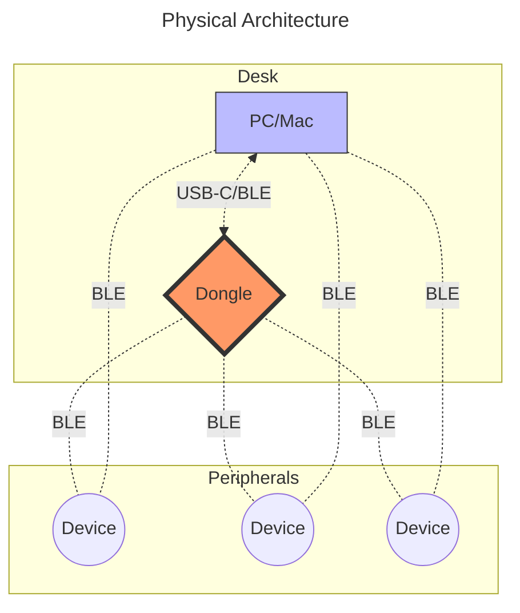

# Jon's ZMK Config

- [한국어](/README_KO.md)
- [English](/README.md)

This is the main document for this repository.

This project is a multi-keyboard ZMK workspace for Jon's personal WFH and remote environments, with shared layout logic powered by the Continuum framework.

## Project Purpose

Core goals:

- Keep one coherent key behavior model across multiple keyboards
- Separate hardware definitions from user layout logic
- Build firmware through reproducible CI targets
- Document each keyboard and workflow in a single repository

## Scope and Status

Implemented:

- Multi-keyboard ZMK configuration repository
- Shield-based hardware separation
- User-level keymaps and feature overrides
- CI-driven firmware builds via GitHub Actions
- Shared Continuum framework for reusable key behaviors and layers

Planned or external:

- Prospector (YADS) role coverage expansion
- Advanced power profiling per device class
- Visual layout rendering pipelines

Each keyboard listed below is expected to have a corresponding shield definition or be explicitly documented as externally maintained.

## Architecture

### Hardware

The diagram represents all supported physical paths, not a single valid runtime topology.



> [!WARNING]
> BLE topology is fixed by firmware role selection. A device cannot act as BLE central and peripheral simultaneously. When built for dongle-based operation, direct host BLE pairing is disabled. Switching back to host-direct BLE requires reflashing and rebonding. USB does not arbitrate or override BLE roles. Transport selection, pairing state, and role assignment are compile-time and boot-time decisions.

### Software Anatomy

Canonical repository layout and responsibility boundaries.

```bash
zmk-config/
├── .github/
│   └── workflows/
│       ├── build.yml                 # Reusable build matrix + merge workflow
│       ├── build-all.yml             # Build all firmware targets
│       ├── build-inputs.yml          # Build selected firmware targets
│       └── release.yml               # Tagged release artifact generation
│
├── boards/
│   └── shields/
│       └── <keyboard_name>/
│           ├── Kconfig.defconfig             # Shield default Kconfig values
│           ├── Kconfig.shield                # Shield registration
│           ├── <keyboard_name>-layouts.dtsi  # Physical key coordinates for rendering
│           ├── <keyboard_name>.conf          # Shield-level defaults
│           ├── <keyboard_name>.dtsi          # Hardware definition
│           ├── <keyboard_name>.keymap        # Factory keymap, optional
│           ├── <keyboard_name>.zmk.yml       # Hardware metadata
│           ├── <keyboard_name>_left.overlay  # Left half mapping
│           ├── <keyboard_name>_right.overlay # Right half mapping
│           ├── <keyboard_name>_left.conf     # Left half Kconfig overrides, optional
│           └── <keyboard_name>_right.conf    # Right half Kconfig overrides, optional
│
├── config/
│   ├── <keyboard_name>.conf          # User overrides and features
│   ├── <keyboard_name>.keymap        # User layers, behaviors, macros, combos
│   └── west.yml                      # ZMK and module manifest
│
├── docs/
│   ├── files/                        # Stored firmware artifacts
│   └── images/                       # Diagrams and reference images
│
└── zephyr/
    └── module.yml                    # Zephyr module definition

```

Separation rules.

- Hardware definition lives under `boards/shields`.
- User behavior and layout live under `config`.
- Documentation and frozen artifacts live under `docs`.
- CI and release logic live under `.github/workflows`.

## Continuum Framework

Continuum is the shared keymap framework under `config/continuum/`.

- It is designed to adapt one personal layout model to different keyboard matrices.
- It is inspired by Miryoku layout concepts and Urob's Timeless HRM approach.
- It minimizes per-keyboard keymap duplication by reusing shared layers, combos, leader sequences, and behavior definitions.

Reference:

- [Continuum Framework Documentation](docs/continuum.md)

## Keyboards

- [Delta Omega](docs/delta_omega.md): Portable ultra-low-profile wireless 3×5+2 split keyboard.
- [Urchin](docs/urchin.md): 34-key low-profile Bluetooth split keyboard.
- [Totem](docs/totem.md): 38-key low-profile split keyboard using KLP Lame keycaps.
- [Corne](docs/corne.md): 36(3x5+3), 42(3x6+3) keys most favored split keyboard.
  - Eyelash Corne: Eyelash modified Corne with screen, roller and joystick.
- [Cornix](docs/cornix.md): Corne-style prebuilt 48-key low-profile split keyboard.
- [Sofle](docs/sofle.md): 68-key low-profile split keyboard with OLED screen and roller.
  - Eyelash Sofle: Eyelash modified Sofle with joystick.

> [!NOTE]
> Each keyboard document includes build targets, firmware naming, flashing steps, and known issues.

## Dongle

> [!WARNING]
> Experimental. Treat as unstable until pairing and reconnect behavior is proven under daily use.

### Roles

- `central`: one dongle as BLE central for multiple pre-bonded split keyboards
- `dongle`: one dongle dedicated to a single keyboard
- `scanner`: status observer role that listens to keyboard advertisements

Role switching is firmware-based and requires reflashing the dongle, and sometimes matching keyboard firmware.
Scanner mode also requires keyboard firmware with status advertisement enabled (this repo uses `scanner-advertisement` snippet).

### Supported hardware variants

- ZMK Dongle Display (`zdd`) hardware
- Prospector hardware (used with YADS firmware track in this repo)

Both hardware variants can run the roles above with role-matching firmware.

### Supported variants by firmware family

- [ZMK Dongle Display](https://github.com/englmaxi/zmk-dongle-display): dongle firmware with 1.3-inch OLED screen support
- [YADS(Yet Another Dongle Screen)](https://github.com/janpfischer/zmk-dongle-screen): robust firmware track for Prospector hardware in this repo
- [Prospector Scanner Module](https://github.com/t-ogura/prospector-zmk-module): scanner/advertisement module used by scanner-mode integration

> [!NOTE]
> See [Dongle](docs/dongle.md) for full technical guide.
> Personal view is documented in [Personal Trade-off Notes](docs/dongle.md#personal-trade-off-notes).

## Layout and Keymap

The layout system in this repository is centered on Continuum, which applies a Miryoku-inspired structure and Timeless-style HRM tuning across keyboards.

Most keyboard keymaps include:

- one matrix mapping header under `config/continuum/matrix/*.h`
- the shared `config/continuum/base.keymap`

### References

- [Home Row Mods (HRM)](https://precondition.github.io/home-row-mods)
- [Miryoku](https://github.com/manna-harbour/miryoku_zmk)
- [Urob's ZMK Config](https://github.com/urob/zmk-config)
  - [Timeless HRM](https://github.com/urob/zmk-config?tab=readme-ov-file#timeless-homerow-mods)
  - [ZMK Helpers](https://github.com/urob/zmk-helpers)

### Layout Design

The layout is based on Miryoku and implements Timeless HRM to minimize typos and modifier misfires, with explicit consideration for multilingual usage.

#### Design Constraints

- Reduce HRM misfires during fast bilingual switching.
- Keep base behavior consistent across boards with different key counts.
- Prefer layers and behaviors over per-board special casing.

> `Magic Shift` is primarily beneficial for English QWERTY layouts. This repository remains Miryoku-based to preserve predictable behavior across multiple languages.

#### Base Layer Choices

- **QWERTY vs. Colemak**: QWERTY is retained to ensure consistent physical mapping for the Korean 2-set (Dubeol-sik) layout and to minimize friction when switching to non-programmable devices.
- **2-set Korean vs. 3-set Korean**: Standard 2-set (Dubeol-sik) is selected for native compatibility with all host operating systems without requiring custom IME software.

**Recommended Combinations:**

- QWERTY + 2-set
- Colemak + 3-set

> [!NOTE]
> Input method selection (e.g., 2-set vs. 3-set) is managed by the host OS settings, not the keyboard firmware.
>
> Read [Korean-Layout](/docs/korean_layout.md) for details.

## Usage

### Development

- Fork the repository
- Clone and customize
- Commit and push to trigger CI build
- Download firmware artifacts from the GitHub Actions tab
- For tagged releases, download release assets (`zmk-firmware-<tag>.zip`, `SHA256SUMS`) for flashing
- GitHub also auto-generates source archives for releases; those are repository snapshots, not flashable firmware
- Flash new firmware to target devices

### Firmware build targets

General rules.

- Shield files live under `boards/shields/<keyboard_name>/`.
- User overrides live under `config/<keyboard_name>.conf`.
- User keymaps live under `config/<keyboard_name>.keymap`.

### Flashing Firmware

1. Connect desired device to PC via USB
2. Enter bootloader mode by double-tapping the reset button
3. A removable drive appears on your PC.
4. Drag'n'drop the `.uf2` file onto the mounted drive.
5. Device reboots, firmware is applied. Done

## Customization

### Easy Mode

After forking the repo, use these GUI tools:

- [Keymap Editor](https://nickcoutsos.github.io/keymap-editor/): Web-based GUI tool to visualize, customize, and reassign functions or commands to keyboard keys, buttons, or remotes
- [Keymap Drawer](https://keymap-drawer.streamlit.app/): Web-based GUI tool to generate visual representations(SVG/PNG images) to document or share layout.
- [Vial](https://vial.rocks/): open-source, GUI-based firmware and software combo that allows real-time, on-the-fly remapping of keys, layers, and macros without needing to re-flash the keyboard.

### Advanced Mode

Primary edit locations.

1. Add features and system behavior, `config/<keyboard_name>.conf`
2. Define layers, behaviors, macros, combos, `config/<keyboard_name>.keymap`
3. Add or modify shield hardware mapping, `boards/shields/<keyboard_name>/`

When adding a new keyboard.

1. Create `boards/shields/<keyboard_name>/` with required shield files.
2. Add `config/<keyboard_name>.conf` and `config/<keyboard_name>.keymap`.
3. Add `docs/<KEYBOARD>.md` describing build, flash, pairing, known issues.
4. Update the Keyboards list in this README.
5. Verify build workflow produces expected artifacts.

See individual device documents under [Keyboards](#keyboards) and [Dongle](#dongle) for details.

## Troubleshooting

### BLE reconnect is slow or unstable

- Power off all unused keyboards.
- Reboot the active keyboard, then attempt reconnect.
- If still stuck, reboot the dongle, then retry.
- If bonds are corrupted, clear bonds on the affected device and re-pair.

### Phantom input or wrong device typing

- Ensure only one keyboard is powered.
- If the wrong device is connected, power it off, then power cycle the intended device.

### Deep sleep surprises

- If a device sleeps too aggressively, adjust sleep settings in config/<keyboard_name>.conf.
- If a device never sleeps, confirm no constant activity sources, such as sensors, LEDs, debug logs.

## Useful Links

### ZMK

- [ZMK documentation](https://zmk.dev/docs)
- [ZMK firmware repository](https://github.com/zmkfirmware/zmk)
- [ZMK Studio](https://zmk.studio/)
- [ZMK keycodes and behaviors](https://zmk.dev/docs/codes)
- [ZMK troubleshooting](https://zmk.dev/docs/troubleshooting)

### Layouts and Modifiers

- [Home Row Mods (HRM)](https://precondition.github.io/home-row-mods)
- [Miryoku](https://github.com/manna-harbour/miryoku_zmk)
- [Urob’s ZMK Config](https://github.com/urob/zmk-config)
  - [Timeless HRM](https://github.com/urob/zmk-config?tab=readme-ov-file#timeless-homerow-mods)
  - [ZMK Helpers](https://github.com/urob/zmk-helpers)
- [Keymap DB](https://keymapdb.com/)

### Tools

#### Keymap Editors GUI

- [Keymap Editor](https://nickcoutsos.github.io/keymap-editor/)
- [Keymap Drawer](https://keymap-drawer.streamlit.app/)
- [Keymap Layout Tool](https://nickcoutsos.github.io/keymap-layout-tools/)
- [Physical Layout Visualizer](https://physical-layout-vis.streamlit.app/)
- [Vial](https://vial.rocks/)
- [ZMK Shield Generator](https://shield-wizard.genteure.workers.dev/)
- [ZMK Locale Generator](https://github.com/joelspadin/zmk-locale-generator)
- [ZMK physical layouts converter](https://zmk-physical-layout-converter.streamlit.app/)
- [ZMK Keymap Viewer](https://github.com/MrMarble/zmk-viewer)

#### Power Profiler

- [ZMK Power Profiler](https://zmk.dev/power-profiler)
- [Power Profiler for BLE](https://devzone.nordicsemi.com/power/w/opp/2/online-power-profiler-for-bluetooth-le)

#### Display Utilities

- [LVGL Image Converter](https://lvgl.io/tools/imageconverter)
- [javl/image2cpp](https://javl.github.io/image2cpp/)
- [joric/qle (QMK Logo Editor)](https://joric.github.io/qle/)
- [notisrac/FileToCArray](https://notisrac.github.io/FileToCArray/)

#### CLI and Utilities

- [zmkfirmware/zmk-cli](https://github.com/zmkfirmware/zmk-cli)
- [zmkfirmware/zmk-docker](https://github.com/zmkfirmware/zmk-docker)
- [urob/zmk-actions](https://github.com/urob/zmk-actions)

### Keyboard List

- [Delta Omega](https://github.com/unspecworks/delta-omega)
- [Urchin](https://github.com/duckyb/urchin)
- [Totem](https://github.com/GEIGEIGEIST/TOTEM)
- [Cornix](https://cornixhub.com/)
- [Sofle](https://github.com/josefadamcik/SofleKeyboard)

## License

This repository is licensed under the [MIT License](/LICENSE).
