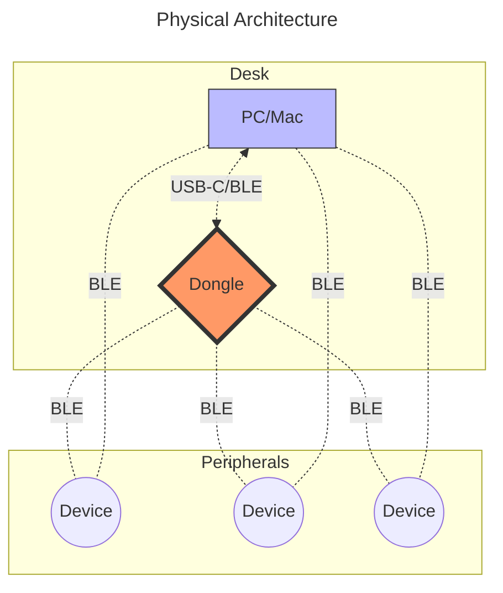

# Jon의 ZMK 설정

- [한국어](/README_KO.md)
- [English](/README.md)

이 문서는 이 저장소의 메인 문서입니다.

이 프로젝트는 Continuum 프레임워크를 중심으로 공통 레이아웃 로직을 공유하는, Jon의 개인 WFH 및 원격 환경용 멀티 키보드 ZMK 워크스페이스입니다.

## 프로젝트 목적

핵심 목표:

- 여러 키보드에서 일관된 키 동작 모델 유지
- 하드웨어 정의와 사용자 레이아웃 로직 분리
- 재현 가능한 CI 타겟으로 펌웨어 빌드
- 하나의 저장소에서 키보드별 문서와 워크플로우 관리

## 범위 및 상태

구현됨:

- 멀티 키보드 ZMK 설정 저장소
- 실드 기반 하드웨어 분리
- 사용자 키맵 및 기능 오버라이드
- GitHub Actions 기반 CI 펌웨어 빌드
- 재사용 가능한 레이어/동작을 위한 Continuum 공통 프레임워크

계획 중 또는 외부 의존:

- Prospector(YADS) 역할 지원 범위 확장
- 디바이스 클래스별 고급 전력 프로파일링
- 현재 매트릭스 외 추가 하드웨어/역할 통합

아래 나열된 각 키보드는 해당 실드 정의를 가지거나, 외부 유지 관리 대상임이 문서에 명시되어야 합니다.

## 아키텍처

### 하드웨어

아래 다이어그램은 지원 가능한 물리 연결 경로 전체를 보여주며, 단일 런타임 토폴로지를 의미하지 않습니다.



> [!WARNING]
> BLE 토폴로지는 펌웨어 역할 선택으로 고정됩니다. 하나의 디바이스가 BLE 중앙 장치와 주변 장치 역할을 동시에 수행할 수는 없습니다. 동글 기반으로 빌드된 경우 호스트 직접 BLE 페어링은 비활성화됩니다. 호스트 직접 BLE로 되돌리려면 재플래시 및 재본딩이 필요합니다. USB는 BLE 역할을 중재하거나 덮어쓰지 않습니다. 전송 경로 선택, 페어링 상태, 역할 할당은 컴파일 시점과 부팅 시점에 결정됩니다.

### 소프트웨어 구조

표준 저장소 레이아웃과 책임 경계:

```bash
zmk-config/
├── .github/
│   └── workflows/
│       ├── build.yml                 # 재사용 가능한 빌드 매트릭스 + 병합 워크플로우
│       ├── build-all.yml             # 전체 펌웨어 타겟 빌드
│       ├── build-inputs.yml          # 선택한 펌웨어 타겟 빌드
│       └── release.yml               # 태그 릴리스 아티팩트 생성
│
├── boards/
│   └── shields/
│       └── <keyboard_name>/
│           ├── Kconfig.defconfig             # 실드 기본 Kconfig 값
│           ├── Kconfig.shield                # 실드 등록
│           ├── <keyboard_name>-layouts.dtsi  # 렌더링용 물리 키 좌표
│           ├── <keyboard_name>.conf          # 실드 레벨 기본값
│           ├── <keyboard_name>.dtsi          # 하드웨어 정의
│           ├── <keyboard_name>.keymap        # 공장 기본 키맵(선택)
│           ├── <keyboard_name>.zmk.yml       # 하드웨어 메타데이터
│           ├── <keyboard_name>_left.overlay  # 왼쪽 하프 매핑
│           ├── <keyboard_name>_right.overlay # 오른쪽 하프 매핑
│           ├── <keyboard_name>_left.conf     # 왼쪽 하프 Kconfig 오버라이드(선택)
│           └── <keyboard_name>_right.conf    # 오른쪽 하프 Kconfig 오버라이드(선택)
│
├── config/
│   ├── <keyboard_name>.conf          # 사용자 오버라이드 및 기능
│   ├── <keyboard_name>.keymap        # 사용자 레이어, 동작, 매크로, 콤보
│   └── west.yml                      # ZMK 및 모듈 매니페스트
│
├── docs/
│   ├── files/                        # 저장된 펌웨어 아티팩트
│   └── images/                       # 다이어그램 및 참고 이미지
│
└── zephyr/
    └── module.yml                    # Zephyr 모듈 정의

```

분리 원칙:

- 하드웨어 정의는 `boards/shields`에 위치
- 사용자 동작과 레이아웃은 `config`에 위치
- 문서 및 고정 아티팩트는 `docs`에 위치
- CI 및 릴리스 로직은 `.github/workflows`에 위치

## Continuum 프레임워크

Continuum은 `config/continuum/` 아래에 있는 공통 키맵 프레임워크입니다.

- 하나의 개인 레이아웃 모델을 다양한 키보드 매트릭스에 적응시키도록 설계되었습니다.
- Miryoku 레이아웃 개념과 Urob의 Timeless HRM 접근에서 영감을 받았습니다.
- 공유 레이어, 콤보, 리더 시퀀스, 동작 정의를 재사용해 키보드별 키맵 중복을 줄입니다.

참고:

- [Continuum Framework Documentation](docs/continuum.md)

## 키보드

- [Delta Omega](docs/delta_omega.md): 휴대용 초저프로파일 무선 3x5+2 분할 키보드
- [Urchin](docs/urchin.md): 34키 로우프로파일 블루투스 분할 키보드
- [Totem](docs/totem.md): KLP Lame 키캡을 사용하는 38키 로우프로파일 분할 키보드
- [Corne](docs/corne.md): 36(3x5+3), 42(3x6+3) 구성의 대표적인 분할 키보드
  - Eyelash Corne: 스크린, 롤러, 조이스틱이 추가된 Eyelash 변형 Corne
- [Cornix](docs/cornix.md): Corne 스타일의 48키 로우프로파일 프리빌트 분할 키보드
- [Sofle](docs/sofle.md): OLED 화면과 롤러를 포함한 68키 로우프로파일 분할 키보드
  - Eyelash Sofle: 조이스틱이 추가된 Eyelash 변형 Sofle

> [!NOTE]
> 각 키보드 문서에는 빌드 타겟, 펌웨어 명명, 플래싱 절차, 알려진 이슈가 포함됩니다.

## 동글

> [!WARNING]
> 실험적 기능입니다. 일상 사용에서 페어링/재연결 동작이 충분히 검증되기 전까지는 불안정할 수 있습니다.

### 역할

- `central`: 하나의 동글이 여러 사전 본딩된 분할 키보드의 BLE 중앙 장치로 동작
- `dongle`: 하나의 키보드 전용 동글로 동작
- `scanner`: 키보드 상태 광고를 수신해 표시하는 관측용 동글 역할

역할 전환은 런타임 토글이 아니라 펌웨어 재플래시 방식이며, 경우에 따라 키보드 펌웨어도 함께 맞춰야 합니다.
또한 scanner 역할은 키보드 펌웨어가 상태 광고를 내보내고, 이에 맞는 scanner 펌웨어 트랙이 함께 필요합니다.

### 지원 하드웨어 변형

- ZMK Dongle Display (`zdd`) 하드웨어
- Prospector 하드웨어 (이 저장소에서는 YADS 펌웨어 트랙 사용)

현재 이 저장소의 `build.yaml` 기준 지원 상태:

- 활성: `zdd` dongle 타겟
- 계획/외부 트랙: Prospector central/scanner 타겟

### 펌웨어 계열별 지원 변형

- [ZMK Dongle Display](https://github.com/englmaxi/zmk-dongle-display): 1.3인치 OLED 화면을 지원하는 동글 펌웨어
- [YADS(Yet Another Dongle Screen)](https://github.com/janpfischer/zmk-dongle-screen): 이 저장소에서 Prospector 하드웨어에 사용하는 대안 펌웨어
- [Prospector Scanner Module](https://github.com/t-ogura/prospector-zmk-module): scanner/advertisement 연동에 사용하는 모듈

> [!NOTE]
> 전체 기술 가이드는 [Dongle](docs/dongle.md) 문서를 참고하세요.
> 개인 관점은 [Personal Trade-off Notes](docs/dongle.md#personal-trade-off-notes)에 정리되어 있습니다.

## 레이아웃 및 키맵

이 저장소의 레이아웃 시스템은 Continuum을 중심으로 구성되며, 여러 키보드에서 Miryoku 기반 구조와 Timeless 스타일 HRM 튜닝을 적용합니다.

대부분의 키보드 키맵은 다음 구성을 포함합니다.

- `config/continuum/matrix/*.h`의 매트릭스 매핑 헤더 1개
- 공유 베이스 키맵 `config/continuum/base.keymap`

### 참고 자료

- [Home Row Mods (HRM)](https://precondition.github.io/home-row-mods)
- [Miryoku](https://github.com/manna-harbour/miryoku_zmk)
- [Urob's ZMK Config](https://github.com/urob/zmk-config)
  - [Timeless HRM](https://github.com/urob/zmk-config?tab=readme-ov-file#timeless-homerow-mods)
  - [ZMK Helpers](https://github.com/urob/zmk-helpers)

### 레이아웃 설계

레이아웃은 Miryoku를 기반으로 하며, 다국어 사용을 고려해 오타와 모디파이어 오동작을 줄이기 위해 Timeless HRM을 적용합니다.

#### 설계 제약

- 빠른 이중 언어 전환 시 HRM 오동작 최소화
- 키 수가 다른 보드에서도 기본 동작 일관성 유지
- 보드별 특수 처리보다 레이어/동작 재사용 우선

> `Magic Shift`는 주로 영어 QWERTY에 유리합니다. 이 저장소는 다국어 환경에서 예측 가능한 동작을 유지하기 위해 Miryoku 기반 접근을 유지합니다.

#### 베이스 레이어 선택

- **QWERTY vs. Colemak**: 한국어 2벌식과의 물리 매핑 일관성 유지 및 비프로그래머블 장치 전환 마찰 최소화를 위해 QWERTY 유지
- **2벌식 vs. 3벌식**: 별도 IME 소프트웨어 없이 주요 OS에서 기본 동작 가능한 2벌식 채택

**권장 조합:**

- QWERTY + 2벌식
- Colemak + 3벌식

> [!NOTE]
> 입력 방식(예: 2벌식/3벌식) 선택은 펌웨어가 아니라 호스트 OS 설정에서 관리됩니다.
>
> 자세한 내용은 [Korean-Layout](/docs/korean_layout.md) 문서를 참고하세요.

## 사용법

### 개발

- 저장소 포크
- 클론 후 커스터마이즈
- 커밋/푸시로 CI 빌드 트리거
- GitHub Actions에서 펌웨어 아티팩트 다운로드
- 태그 릴리스는 릴리스 자산(`zmk-firmware-<tag>.zip`, `SHA256SUMS`)을 받아 플래시에 사용
- GitHub가 자동 생성하는 소스 코드 아카이브는 저장소 스냅샷이며 플래시용 펌웨어가 아님
- 대상 디바이스에 플래시

### 펌웨어 빌드 타겟

일반 규칙:

- 실드 파일은 `boards/shields/<keyboard_name>/`에 위치
- 사용자 오버라이드는 `config/<keyboard_name>.conf`에 위치
- 사용자 키맵은 `config/<keyboard_name>.keymap`에 위치

### 펌웨어 플래싱

1. USB로 대상 디바이스를 PC에 연결
2. 리셋 버튼 더블탭으로 부트로더 모드 진입
3. 이동식 드라이브가 나타나는지 확인
4. `.uf2` 파일을 마운트된 드라이브로 드래그 앤 드롭
5. 디바이스 재부팅 후 펌웨어 적용 완료

## 커스터마이징

### Easy Mode

저장소 포크 후 아래 GUI 도구를 사용할 수 있습니다.

- [Keymap Editor](https://nickcoutsos.github.io/keymap-editor/): 키 기능 시각화/재할당
- [Keymap Drawer](https://keymap-drawer.streamlit.app/): 키맵 다이어그램(SVG/PNG) 생성
- [Vial](https://vial.rocks/): 재플래시 없이 실시간 키/레이어/매크로 리매핑

### Advanced Mode

주요 편집 위치:

1. 기능 및 시스템 동작: `config/<keyboard_name>.conf`
2. 레이어/동작/매크로/콤보: `config/<keyboard_name>.keymap`
3. 실드 하드웨어 매핑: `boards/shields/<keyboard_name>/`

새 키보드 추가 시:

1. `boards/shields/<keyboard_name>/` 생성 및 필수 실드 파일 추가
2. `config/<keyboard_name>.conf`, `config/<keyboard_name>.keymap` 추가
3. 빌드/플래시/페어링/알려진 이슈를 설명하는 `docs/<KEYBOARD>.md` 추가
4. 이 README의 키보드 목록 업데이트
5. 빌드 워크플로우에서 아티팩트 생성 여부 확인

자세한 내용은 [키보드](#키보드)와 [동글](#동글) 섹션의 개별 문서를 참고하세요.

## 문제 해결

### BLE 재연결이 느리거나 불안정한 경우

- 사용하지 않는 키보드 전원 끄기
- 활성 키보드 재부팅 후 재연결 시도
- 계속 실패하면 동글 재부팅 후 재시도
- 본딩 손상 시 해당 디바이스 본딩 초기화 후 재페어링

### 의도하지 않은 디바이스에서 입력되는 경우

- 동시에 하나의 키보드만 켜져 있는지 확인
- 잘못 연결된 디바이스 전원을 끄고 의도한 디바이스를 전원 사이클

### 딥 슬립 동작이 이상한 경우

- 너무 빨리 슬립되면 `config/<keyboard_name>.conf`에서 슬립 타임아웃 조정
- 슬립이 전혀 되지 않으면 센서/LED/디버그 로그 등 지속 활동 소스 점검

## 유용한 링크

### ZMK

- [ZMK documentation](https://zmk.dev/docs)
- [ZMK firmware repository](https://github.com/zmkfirmware/zmk)
- [ZMK Studio](https://zmk.studio/)
- [ZMK keycodes and behaviors](https://zmk.dev/docs/codes)
- [ZMK troubleshooting](https://zmk.dev/docs/troubleshooting)

### 레이아웃 및 모디파이어

- [Home Row Mods (HRM)](https://precondition.github.io/home-row-mods)
- [Miryoku](https://github.com/manna-harbour/miryoku_zmk)
- [Urob's ZMK Config](https://github.com/urob/zmk-config)
  - [Timeless HRM](https://github.com/urob/zmk-config?tab=readme-ov-file#timeless-homerow-mods)
  - [ZMK Helpers](https://github.com/urob/zmk-helpers)
- [Keymap DB](https://keymapdb.com/)

### 도구

#### Keymap Editors GUI

- [Keymap Editor](https://nickcoutsos.github.io/keymap-editor/)
- [Keymap Drawer](https://keymap-drawer.streamlit.app/)
- [Keymap Layout Tool](https://nickcoutsos.github.io/keymap-layout-tools/)
- [Physical Layout Visualizer](https://physical-layout-vis.streamlit.app/)
- [Vial](https://vial.rocks/)
- [ZMK Shield Generator](https://shield-wizard.genteure.workers.dev/)
- [ZMK Locale Generator](https://github.com/joelspadin/zmk-locale-generator)
- [ZMK physical layouts converter](https://zmk-physical-layout-converter.streamlit.app/)
- [ZMK Keymap Viewer](https://github.com/MrMarble/zmk-viewer)

#### Power Profiler

- [ZMK Power Profiler](https://zmk.dev/power-profiler)
- [Power Profiler for BLE](https://devzone.nordicsemi.com/power/w/opp/2/online-power-profiler-for-bluetooth-le)

#### Display Utilities

- [LVGL Image Converter](https://lvgl.io/tools/imageconverter)
- [javl/image2cpp](https://javl.github.io/image2cpp/)
- [joric/qle (QMK Logo Editor)](https://joric.github.io/qle/)
- [notisrac/FileToCArray](https://notisrac.github.io/FileToCArray/)

#### CLI and Utilities

- [zmkfirmware/zmk-cli](https://github.com/zmkfirmware/zmk-cli)
- [zmkfirmware/zmk-docker](https://github.com/zmkfirmware/zmk-docker)
- [urob/zmk-actions](https://github.com/urob/zmk-actions)

### 키보드 목록

- [Delta Omega](https://github.com/unspecworks/delta-omega)
- [Urchin](https://github.com/duckyb/urchin)
- [Totem](https://github.com/GEIGEIGEIST/TOTEM)
- [Cornix](https://cornixhub.com/)
- [Sofle](https://github.com/josefadamcik/SofleKeyboard)

## 라이선스

이 저장소는 [MIT License](/LICENSE)를 따릅니다.
