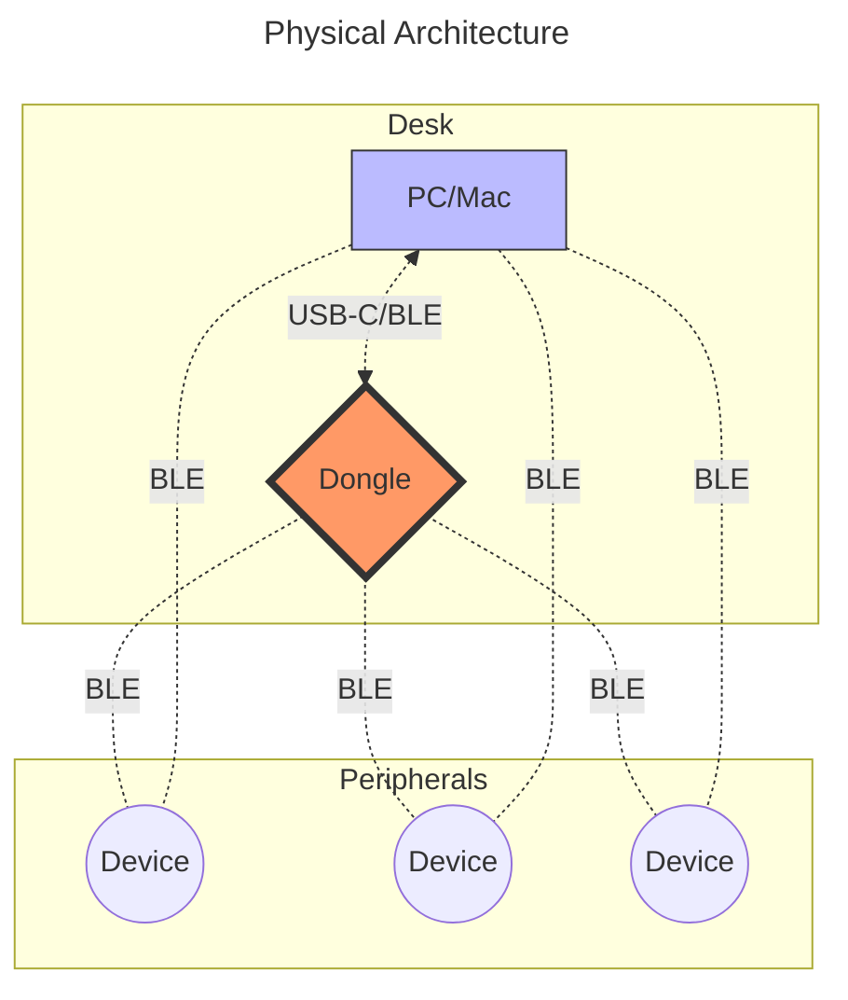

# Jon의 ZMK 설정

- [한국어](/README_KO.md)
- [English](/README.md)

Jon의 WFH 및 원격 환경을 위한 ZMK 설정 저장소.

## 아키텍처

### 하드웨어

아래 다이어그램은 지원되는 모든 물리적 연결 경로를 나타내며, 단일한 런타임 토폴로지를 의미하지 않는다.



> [!WARNING]
> BLE 토폴로지는 펌웨어의 역할 선택에 의해 고정된다. 하나의 디바이스는 동시에 BLE 중앙 장치와 주변 장치로 동작할 수 없다. 동글 기반 동작으로 빌드된 경우 호스트와의 직접 BLE 페어링은 비활성화된다. 호스트 직접 BLE로 되돌리려면 재플래시와 재본딩이 필요하다. USB는 BLE 역할을 중재하거나 우선하지 않는다. 전송 경로 선택, 페어링 상태, 역할 할당은 컴파일 시점과 부팅 시점에 결정된다.

### 소프트웨어 구조

표준 저장소 레이아웃과 책임 경계.

```bash
zmk-config/
├── .github/
│   └── workflows/
│       ├── build.yml                 # CI 펌웨어 빌드
│       └── release_with_tag.yml      # 태그 기반 릴리스 아티팩트 생성
│
├── boards/
│   └── shields/
│       └── <keyboard_name>/
│           ├── Kconfig.defconfig             # 실드 기본 Kconfig 값
│           ├── Kconfig.shield                # 실드 등록
│           ├── <keyboard_name>-layouts.dtsi  # 렌더링용 물리 키 좌표
│           ├── <keyboard_name>.conf          # 실드 레벨 기본 설정
│           ├── <keyboard_name>.dtsi          # 하드웨어 정의
│           ├── <keyboard_name>.keymap        # 공장 기본 키맵, 선택 사항
│           ├── <keyboard_name>.zmk.yml       # 하드웨어 메타데이터
│           ├── <keyboard_name>_left.overlay  # 왼쪽 하프 매핑
│           ├── <keyboard_name>_right.overlay # 오른쪽 하프 매핑
│           ├── <keyboard_name>_left.conf     # 왼쪽 하프 Kconfig 오버라이드, 선택 사항
│           └── <keyboard_name>_right.conf    # 오른쪽 하프 Kconfig 오버라이드, 선택 사항
│
├── config/
│   ├── <keyboard_name>.conf          # 사용자 오버라이드 및 기능
│   ├── <keyboard_name>.keymap        # 사용자 레이어, 동작, 매크로, 콤보
│   └── west.yml                      # ZMK 및 모듈 매니페스트
│
├── docs/
│   ├── files/                        # 저장된 펌웨어 아티팩트
│   └── images/                       # 다이어그램 및 참고 이미지
│
└── zephyr/
    └── module.yml                    # Zephyr 모듈 정의

```

분리 원칙.

- 하드웨어 정의는 `boards/shields` 아래에 위치한다.
- 사용자 동작과 레이아웃은 `config` 아래에 위치한다.
- 문서와 고정 아티팩트는 `docs` 아래에 위치한다.
- CI 및 릴리스 로직은 `.github/workflows` 아래에 위치한다.

## 키보드

- [Delta Omega](docs/delta_omega.md): 휴대용 초저프로파일 무선 3×5+2 분할 키보드.
- [Urchin](docs/urchin.md): 34키 로우프로파일 블루투스 분할 키보드.
- [Totem](docs/totem.md): KLP Lame 키캡을 사용하는 38키 로우프로파일 분할 키보드.
- [Cornix](docs/cornix.md): Corne 스타일의 48키 로우프로파일 프리빌트 분할 키보드.
- [Sofle](docs/sofle.md): OLED, 롤러, 조이스틱을 포함한 68키 로우프로파일 분할 키보드.

> [!NOTE]
> 각 키보드 문서에는 빌드 타겟, 펌웨어 명명 규칙, 플래싱 절차, 알려진 이슈가 포함되어 있다.

## 동글

> [!WARNING]
> 실험적 상태. 일상적인 사용에서 페어링 및 재연결 동작이 검증될 때까지 안정적이라고 가정하지 말 것.

### 펌웨어 계열별 지원 변형

- [ZMK Dongle Display](https://github.com/englmaxi/zmk-dongle-display): 1.3인치 OLED 화면을 지원하는 동글 펌웨어
- [Prospector](https://github.com/carrefinho/prospector-zmk-module): 1.69인치 IPS LCD 화면을 지원하는 동글 펌웨어
- [YADS(Yet Another Dongle Screen)](https://github.com/janpfischer/zmk-dongle-screen): ZMK Dongle Display에서 영감을 받은 Prospector 파생 펌웨어

> [!NOTE]
> 자세한 내용은 [Dongle](docs/DONGLE.md) 문서를 참고할 것.

## 레이아웃 및 키맵

이 설정은 [Home Row Mod(HRM)](https://precondition.github.io/home-row-mods)를 중심으로, Miryoku 기반 레이아웃과 Timeless HRM 동작을 사용하도록 구성되어 있다.

참고 자료.

- [Home Row Mod(HRM)](https://precondition.github.io/home-row-mods)
- [Miryoku](https://github.com/manna-harbour/miryoku_zmk)
- [Urob의 ZMK 설정](https://github.com/urob/zmk-config)
  - [Timeless HRM](https://github.com/urob/zmk-config?tab=readme-ov-file#timeless-homerow-mods)
  - [ZMK Helpers](https://github.com/urob/zmk-helpers)

### 레이아웃 설계

이 레이아웃은 Miryoku를 기반으로 하며, 다국어 및 이중 언어 사용을 고려하여 오타와 모더 오동작을 최소화하도록 Timeless HRM을 적용한다.

설계 제약.

- 빠른 이중 언어 전환 중 HRM 오동작 최소화.
- 키 개수가 다른 보드 간에도 기본 동작을 일관되게 유지.
- 보드별 특수 처리보다 레이어와 동작을 우선.

> `Magic Shift`는 주로 영어 QWERTY 레이아웃에 유용하다. 이 저장소는 여러 언어에서 예측 가능한 동작을 유지하기 위해 Miryoku 기반을 유지한다.

## 사용법

### 개발

- 저장소 포크
- 클론 및 커스터마이즈
- 커밋 및 푸시로 CI 빌드 트리거
- GitHub Actions 탭에서 펌웨어 아티팩트 다운로드
- 대상 디바이스에 새 펌웨어 플래시

### 펌웨어 빌드 타겟

일반 규칙.

- 실드 파일은 `boards/shields/<keyboard_name>/` 아래에 위치한다.
- 사용자 오버라이드는 `config/<keyboard_name>.conf`에 위치한다.
- 사용자 키맵은 `config/<keyboard_name>.keymap`에 위치한다.

권장 아티팩트 명명 규칙.

- `<keyboard_name>_left.uf2`
- `<keyboard_name>_right.uf2`
- 동글 빌드는 `dongle.uf2` 또는 `<dongle_variant>.uf2`

### 펌웨어 플래싱

1. USB를 통해 대상 디바이스를 PC에 연결
2. 리셋 버튼을 두 번 눌러 부트로더 모드 진입
3. PC에 이동식 드라이브가 나타남
4. `.uf2` 파일을 마운트된 드라이브로 드래그 앤 드롭
5. 디바이스가 재부팅되며 펌웨어 적용 완료

## 커스터마이징

### Easy Mode

저장소를 포크한 후 다음 GUI 도구를 사용한다.

- [Keymap Editor](https://nickcoutsos.github.io/keymap-editor/): 키보드 키, 버튼, 리모트의 기능을 시각화하고 재할당할 수 있는 웹 기반 GUI 도구
- [Keymap Drawer](https://keymap-drawer.streamlit.app/): 레이아웃 문서화나 공유를 위한 시각적 표현(SVG, PNG)을 생성하는 웹 기반 GUI 도구
- [Vial](https://vial.rocks/): 재플래시 없이 실시간으로 키, 레이어, 매크로를 변경할 수 있는 오픈소스 GUI 기반 펌웨어 및 소프트웨어 조합

### Advanced Mode

주요 편집 위치.

1. 기능 및 시스템 동작 추가, `config/<keyboard_name>.conf`
2. 레이어, 동작, 매크로, 콤보 정의, `config/<keyboard_name>.keymap`
3. 실드 하드웨어 매핑 추가 또는 수정, `boards/shields/<keyboard_name>/`

새 키보드 추가 시.

1. 필요한 실드 파일과 함께 `boards/shields/<keyboard_name>/` 생성
2. `config/<keyboard_name>.conf` 및 `config/<keyboard_name>.keymap` 추가
3. 빌드, 플래시, 페어링, 알려진 이슈를 설명하는 `docs/<KEYBOARD>.md` 추가
4. 이 README의 키보드 목록 업데이트
5. 빌드 워크플로우가 예상 아티팩트를 생성하는지 확인

자세한 내용은 [키보드](#키보드) 및 [동글](#동글) 항목의 개별 문서를 참고할 것.

## 문제 해결

### BLE 재연결이 느리거나 불안정한 경우

- 사용하지 않는 모든 키보드의 전원을 끈다.
- 활성 키보드를 재부팅한 후 재연결 시도.
- 여전히 문제가 있으면 동글을 재부팅한 뒤 다시 시도.
- 본딩이 손상된 경우 해당 디바이스의 본딩을 삭제하고 재페어링.

### 입력이 다른 디바이스에서 발생하는 경우

- 한 번에 하나의 키보드만 켜져 있는지 확인.
- 잘못 연결된 디바이스가 있다면 전원을 끄고 의도한 디바이스를 전원 사이클.

### 딥 슬립 관련 문제

- 너무 빨리 슬립되는 경우 `config/<keyboard_name>.conf`에서 슬립 설정 조정.
- 전혀 슬립되지 않는 경우 센서, LED, 디버그 로그 등 지속적인 활동 소스가 없는지 확인.

## 유용한 링크

### ZMK

- [ZMK 문서](https://zmk.dev/docs)
- [ZMK 펌웨어 저장소](https://github.com/zmkfirmware/zmk)
- [ZMK Studio](https://zmk.studio/)
- [ZMK 키코드 및 동작](https://zmk.dev/docs/codes)
- [ZMK 문제 해결](https://zmk.dev/docs/troubleshooting)

### 레이아웃 및 모더

- [Home Row Mods (HRM)](https://precondition.github.io/home-row-mods)
- [Miryoku](https://github.com/manna-harbour/miryoku_zmk)
- [Urob의 ZMK 설정](https://github.com/urob/zmk-config)
  - [Timeless HRM](https://github.com/urob/zmk-config?tab=readme-ov-file#timeless-homerow-mods)
  - [ZMK Helpers](https://github.com/urob/zmk-helpers)
- [Keymap DB](https://keymapdb.com/)

### 도구

#### Keymap Editors GUI

- [Keymap Editor](https://nickcoutsos.github.io/keymap-editor/)
- [Keymap Drawer](https://keymap-drawer.streamlit.app/)
- [Keymap Layout Tool](https://nickcoutsos.github.io/keymap-layout-tools/)
- [Physical Layout Visualizer](https://physical-layout-vis.streamlit.app/)
- [Vial](https://vial.rocks/)
- [ZMK Shield Generator](https://shield-wizard.genteure.workers.dev/)
- [ZMK Locale Generator](https://github.com/joelspadin/zmk-locale-generator)
- [ZMK physical layouts converter](https://zmk-physical-layout-converter.streamlit.app/)
- [ZMK Keymap Viewer](https://github.com/MrMarble/zmk-viewer)

#### Power Profiler

- [ZMK Power Profiler](https://zmk.dev/power-profiler)
- [Power Profiler for BLE](https://devzone.nordicsemi.com/power/w/opp/2/online-power-profiler-for-bluetooth-le)

#### Display Utilities

- [LVGL Image Converter](https://lvgl.io/tools/imageconverter)
- [javl/image2cpp](https://javl.github.io/image2cpp/)
- [joric/qle (QMK Logo Editor)](https://joric.github.io/qle/)
- [notisrac/FileToCArray](https://notisrac.github.io/FileToCArray/)

#### CLI and Utilities

- [zmkfirmware/zmk-cli](https://github.com/zmkfirmware/zmk-cli)
- [zmkfirmware/zmk-docker](https://github.com/zmkfirmware/zmk-docker)
- [urob/zmk-actions](https://github.com/urob/zmk-actions)

### 키보드 목록

- [Delta Omega](https://github.com/unspecworks/delta-omega)
- [Urchin](https://github.com/duckyb/urchin)
- [Totem](https://github.com/GEIGEIGEIST/TOTEM)
- [Cornix](https://github.com/foostan/crkbd)
- [Sofle](https://github.com/josefadamcik/SofleKeyboard)

## 라이선스

이 저장소는 [MIT License](/LICENSE)로 배포된다.
