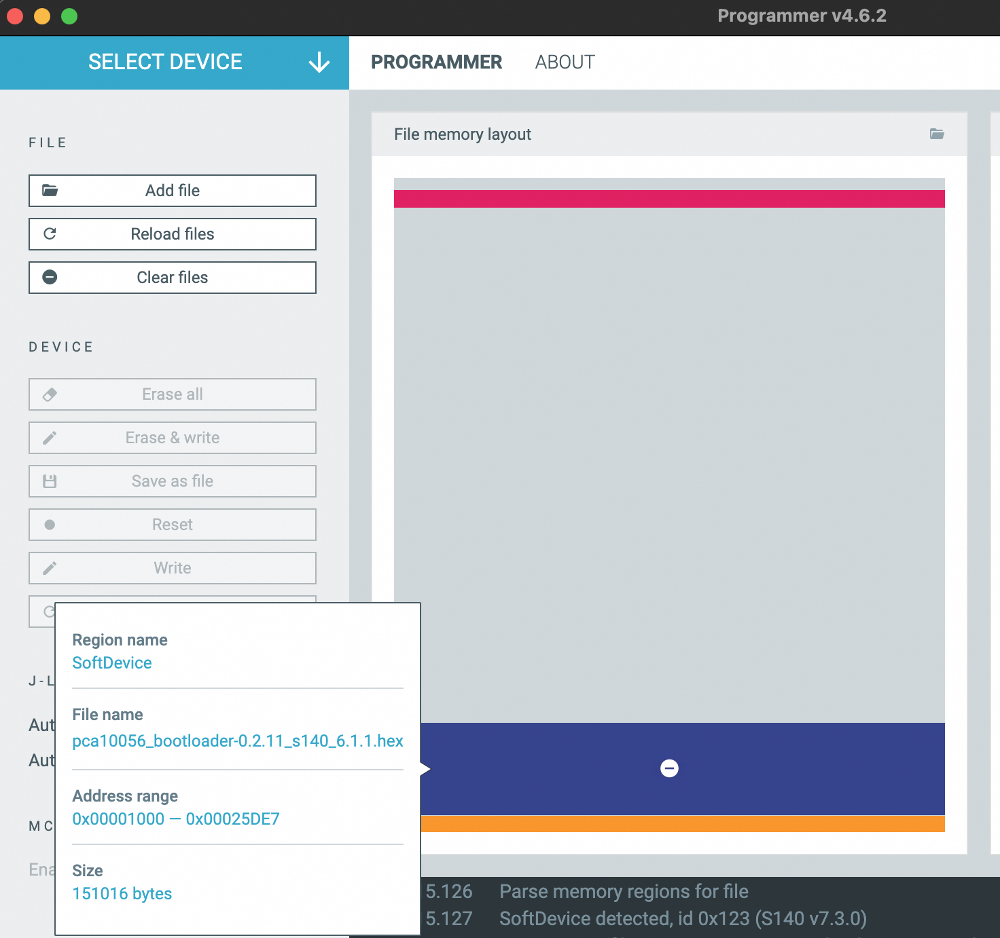

# Extracting SoftDevice (s140) for nRF52840

Download the bootloader for nRF52840 from:

- Official repository: [https://github.com/joric/nrfmicro/wiki/Bootloader](https://github.com/joric/nrfmicro/wiki/Bootloader)
- This bootloader is compatible with nRF52840-based keyboards using ZMK firmware

These commands extract the SoftDevice (s140) from the bootloader HEX file and convert it to UF2 format for flashing:

```bash
# Convert HEX to binary
arm-none-eabi-objcopy -I ihex -O binary pca10056_bootloader-0.2.11_s140_6.1.1.hex full_flash.bin

# Extract SoftDevice section
# Skip bootloader (4096 bytes, start address 0x1000)
# Count matches SoftDevice size (151016 bytes, end address: 0x25DE7 )
dd if=full_flash.bin of=s140_sd_only.bin bs=1 skip=4096 count=151016

# method 1: generate hex file,  flashing with nrfutil or nrf connect
arm-none-eabi-objcopy -O ihex -I binary s140_sd_only.bin s140_sd_only.hex
arm-none-eabi-objcopy --change-address 0x1000 s140_sd_only.hex  s140_sd_only.hex

# method 2: generate uf2 , flash by uf2 bootloader
# Convert bin content to UF2 format with start address for flashing
python3 uf2conv.py s140_sd_only.bin -f 0xada52840 -b 0x1000 -c -o s140_restore.uf2
```

nRF Connect for Desktop's Programer is very useful for getting sd address and size from bootloader hex file.



### Extracting SoftDevice (s130) for nRF51

Command to extract SoftDevice (s130) section:

```bash
# Skip bootloader (4096 bytes)
dd if=full_flash.bin of=s132_sd_only.bin bs=1 skip=4096 count=155648
```
